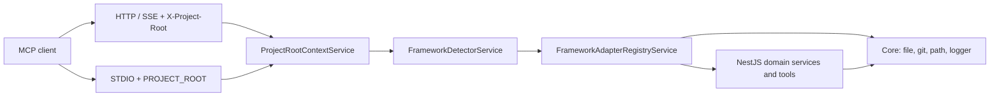

# Architecture

**Pattern:** One NestJS application hosting the MCP “product” with **ports/adapters** for target frameworks. **Only NestJS** is fully implemented; static `alaz://` resources use **Option C** (framework adapter delegation — see `docs/MCP-FRAMEWORK-PORTS.md`).

**MCP surface (current):** **12 tools** (module/entity/endpoint/changes/tests/conventions + five **prompt-as-tool** guides for clients without `prompts/get`), **7 static + 3 template** resources, **5 prompts** (see `docs/MCP-SERVER.md`).

## High-level structure

- **`AppModule`** loads global `ConfigModule` and **`McpNestjsModule`**
- **`McpNestjsModule`**: registers `@rekog/mcp-nest` transport (Streamable HTTP + SSE), applies **`ProjectRootMiddleware`** to `mcp`, `sse`, `messages`
- **`McpCoreModule`**: file/git/path logging, framework detection, project root (AsyncLocalStorage + STDIO `enterWith` fallback)
- **Domain split:** `NestjsDomainModule` (tools, resources, prompts, Nest-specific adapters) + `SharedDomainModule` (changelog, recent changes) depending on `NestjsDomainModule`

## Identified patterns

### Port-based framework adapters

**Location:** `src/mcp/core/ports/*.ts`  
**Purpose:** `IModuleRegistry`, `IEntityIntrospector`, `ICodebaseAnalyzer`, `IDocumentationReader`, `IProjectContext` keep MCP surfaces stable while per-framework code varies.  
**Implementation:** `FrameworkAdapterRegistryService` (`src/mcp/domain/nestjs/data-access/services/framework-adapter-registry.service.ts`) returns NestJS service instances for `nestjs`; returns `null` for adapters when unsupported and exposes user-facing messages for Angular/Laravel/unknown.  
**Example:** `getModuleRegistry('nestjs')` → `ModuleRegistryService`.

### Per-request project root (HTTP)

**Location:** `src/mcp/core/feature/middleware/project-root.middleware.ts`, `src/mcp/core/data-access/services/project-root-context.service.ts`  
**Purpose:** All analysis is rooted at the path supplied by the client, not the server’s CWD.  
**Implementation:** Middleware reads `x-project-root` header, rejects with 400 if missing; `AsyncLocalStorage` stores the value for the request.  
**Example:** E2E passes `X-Project-Root` in `test/e2e/setup/mcp-client.setup.ts` (`projectRootHeaders`).

### Process-wide project root (STDIO)

**Location:** `src/mcp/feature/mcp-stdio.entry.ts`  
**Purpose:** No HTTP headers; one analyzed project per process.  
**Implementation:** Exits if `PROJECT_ROOT` unset; `ProjectRootContextService.enterWith(projectRoot)` after creating application context. Env fallback in `getProjectRoot()` when ALS context is lost.  
**Example:** `projectRootContext.enterWith(projectRoot)` in `mcp-stdio.entry.ts`.

### Entity parsing strategy chain

**Location:** `src/mcp/domain/nestjs/data-access/strategies/`, `entity-parser-strategies.token.ts`  
**Purpose:** Pluggable ORM-specific entity parsing (MikroORM, TypeORM, Objection).  
**Implementation:** `ENTITY_PARSER_STRATEGIES` multi-injects strategies; introspector picks the one that applies.

## Data flow

### HTTP MCP request (typical tool call)

1. Client POSTs to `/mcp` (or related routes) with JSON-RPC body and `X-Project-Root: /abs/path/to/analyzed/repo`.
2. `ProjectRootMiddleware` validates header and `run(root, next)` for the request.
3. Tool/resource handler uses `ProjectRootContextService.getProjectRoot()` and `FileReaderService` / git services to read *target* project files.
4. `FrameworkDetectorService.detect()` reads target `package.json` / `composer.json` (with per-root cache, max 10 entries).
5. `FrameworkAdapterRegistryService` dispatches; NestJS path uses registered services. Non-Nest or “coming soon” returns structured messages to the client (see `UNSUPPORTED_FRAMEWORK_MESSAGE` in `framework-adapter-registry.service.ts`).

### STDIO bootstrap

1. `PROJECT_ROOT` required; `NestFactory.createApplicationContext(McpStdioAppModule)`.
2. `enterWith` seeds ALS; MCP transport reads stdin/stdout.
3. Same detection/registry flow as above when tools run.

## Code organization

**Approach:** Feature/domain folders under `src/mcp/`: `core` (framework-agnostic infrastructure + ports + middleware), `domain/nestjs` (Nest tools/resources/prompts and Nest adapters), `domain/shared` (cross-framework tools that still depend on Nestjs domain for registration), `domain/angular` and `domain/laravel` (empty placeholders), `util` (env schema, parser, confirmation prompt helpers), `feature` (MCP module wiring, STDIO entry).

**Module boundaries:** New MCP tools/resources/prompts are registered in `nestjs.domain.module.ts` or `shared.domain.module.ts` per `.cursor/rules/mcp-development.mdc`.
