# Alaz MCP Server — Flows, Diagrams & Architecture Report

MCP Server that exposes the live context of any NestJS project to AI agents (Cursor, Claude Desktop, etc.). This document describes the architecture, data flows, and applications.

> **Viewing Mermaid diagrams**: The preview in Cursor/VSCode requires the [Markdown Preview Mermaid Support](https://marketplace.visualstudio.com/items?itemName=bierner.markdown-mermaid) extension. Install it and reopen the preview. On GitHub, diagrams render natively.

## 1. Architecture Overview

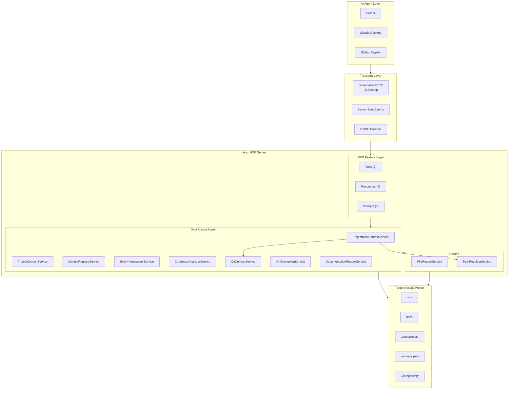

## 2. Transport Modes

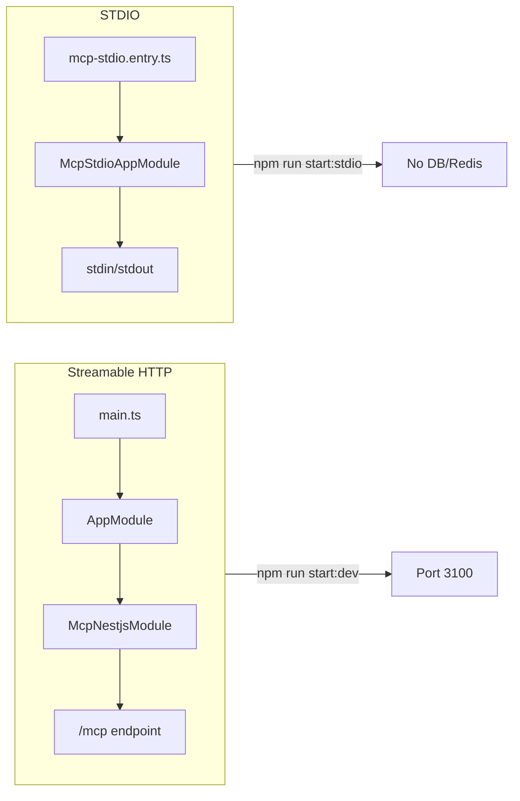

| Mode | Entry Point | Project Root Source | Use Case |
|------|-------------|--------------------|----------|
| Streamable HTTP | `main.ts` → `AppModule` | `headers["X-Project-Root"]` in mcp.json | Primary mode, full API |
| STDIO | `mcp-stdio.entry.ts` → `McpStdioAppModule` | `env.PROJECT_ROOT` in mcp.json | Lightweight, no database |

**Project root is required.** Configure it in `.cursor/mcp.json` (or equivalent MCP config). Use `${workspaceFolder}` for the current workspace. No fallback — if missing, the MCP returns an error.

## 3. Project Context Detection Flow

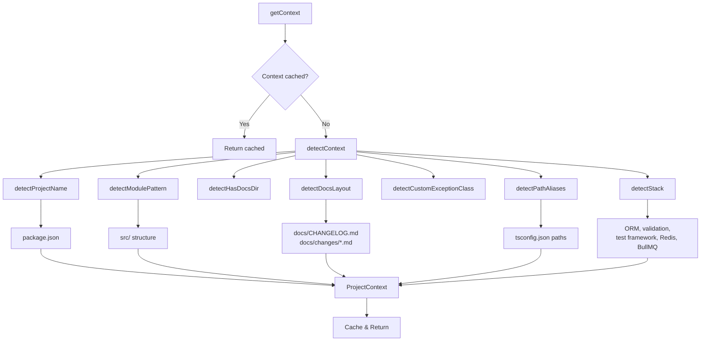

## 4. Project Root Resolution (Config-Driven)

The MCP is **project-agnostic**: the project root is dynamic and comes from the MCP configuration or tool parameters. No fallback — if the path is not provided, the MCP returns an error.

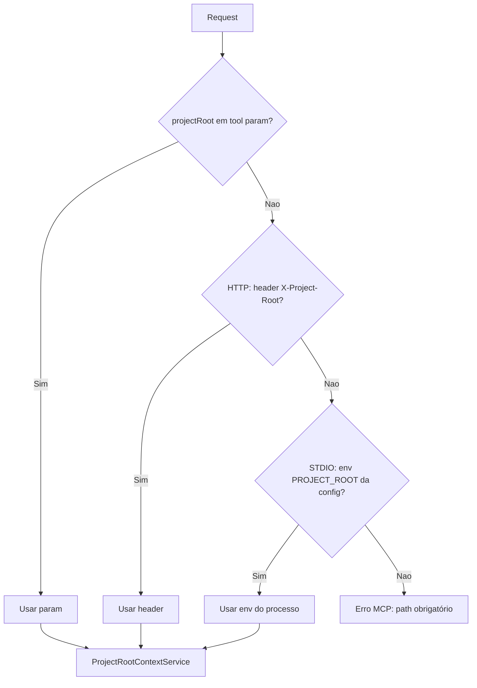

| Mode | Source in mcp.json | Example |
|------|--------------------|---------|
| **HTTP** | `headers["X-Project-Root"]` | `"X-Project-Root": "${workspaceFolder}"` |
| **STDIO** | `env.PROJECT_ROOT` | `"PROJECT_ROOT": "${workspaceFolder}"` |

Tools accept an optional `projectRoot` parameter to override per request. Resources and prompts use the context set by the middleware (HTTP) or STDIO bootstrap.

## 5. Module Discovery Flow

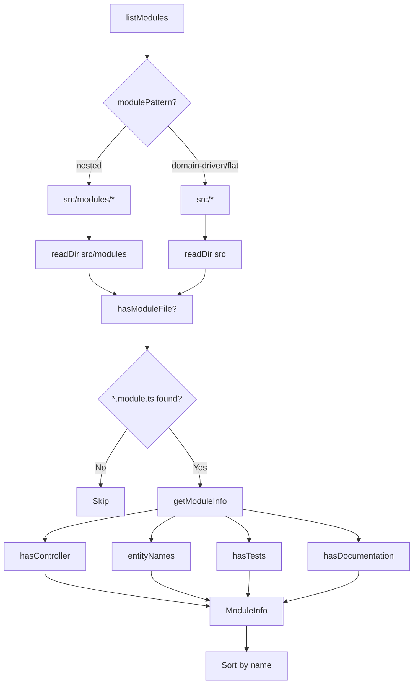

## 6. Entity Schema Flow

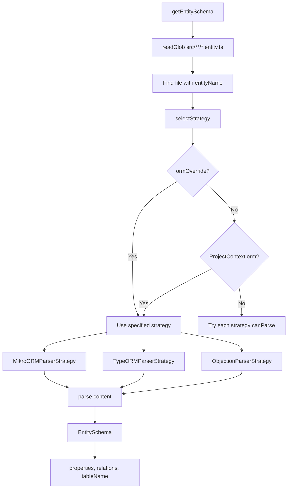

## 7. Changelog Generation Flow

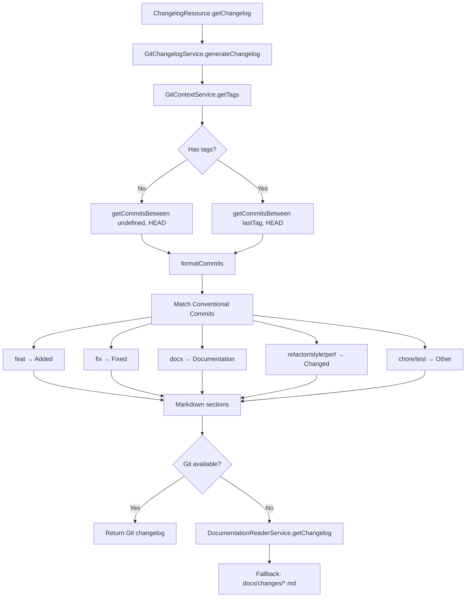

## 8. Onboarding Resource Flow

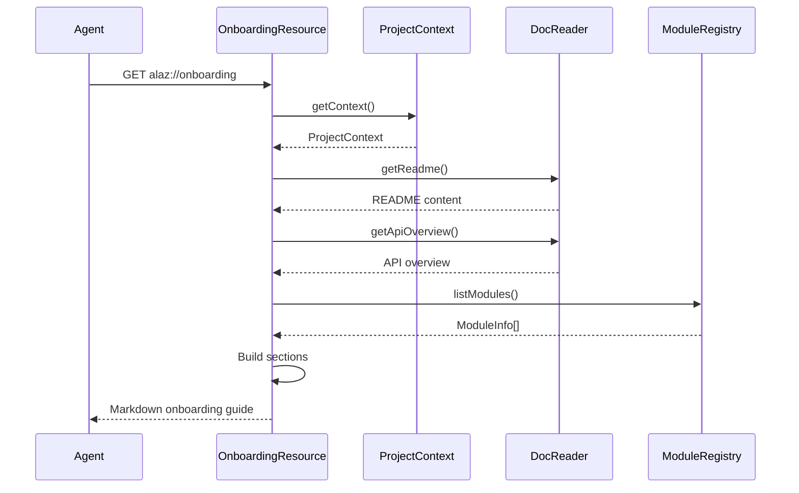

## 9. Tools Dependency Graph

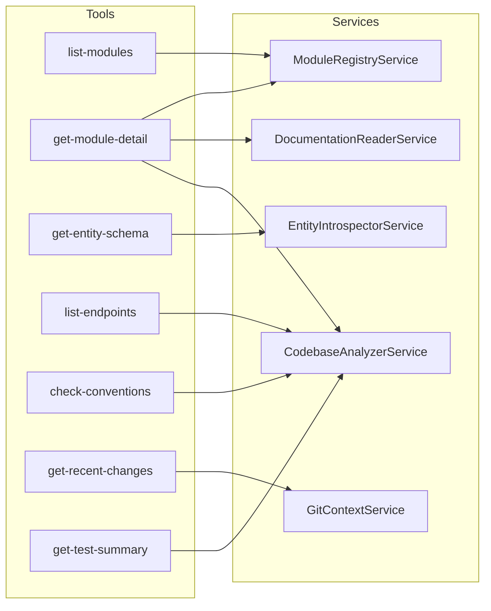

## 10. Resources & Prompts Overview

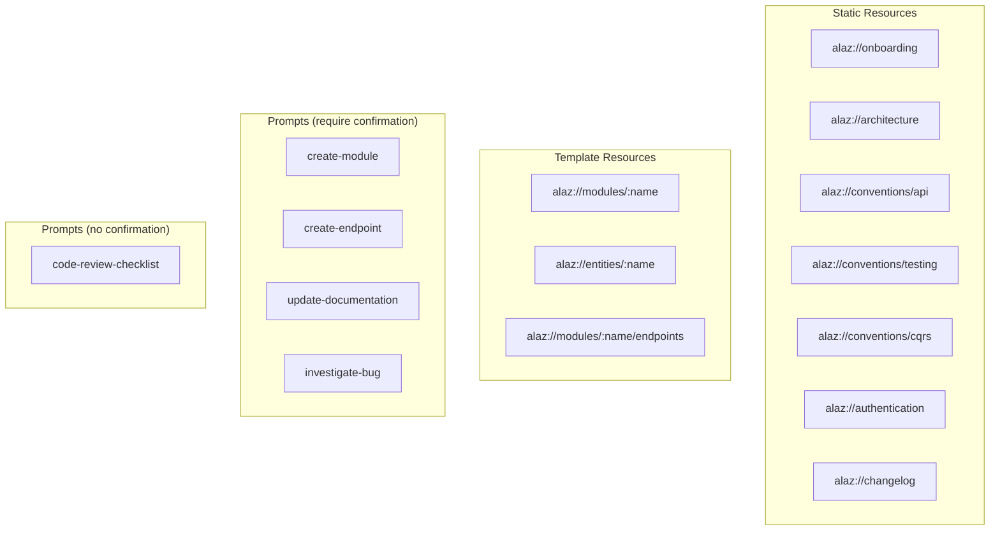

## 11. Applications

| Use Case | Tools/Resources | Description |
|----------|-----------------|-------------|
| **Onboarding** | `alaz://onboarding` | Aggregated guide: stack, modules, resources |
| **Module creation** | `create-module` prompt | Template for new NestJS modules |
| **Endpoint creation** | `create-endpoint` prompt | Template for new HTTP endpoints |
| **Documentation** | `update-documentation` prompt, `alaz://modules/{name}` | Guide doc updates |
| **Entity inspection** | `get-entity-schema`, `alaz://entities/{name}` | ORM schema (MikroORM, TypeORM, Objection) |
| **Convention check** | `check-conventions` | Validate project conventions |
| **Recent changes** | `get-recent-changes`, `alaz://changelog` | Commits and versioned changelog |
| **Bug investigation** | `investigate-bug` prompt | Debugging steps |
| **Code review** | `code-review-checklist` prompt | Review criteria |

## 12. File Structure

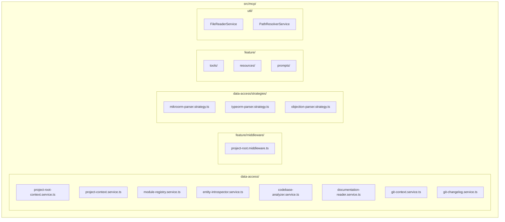

## 13. Environment Variables & Project Root

### Server environment variables (.env)

| Variable | Required | Description |
|----------|----------|--------------|
| `PORT` | No | HTTP port (default 3100) |
| `NODE_ENV` | No | development/staging/production |

### Project root (MCP config — mcp.json)

The project root is **not** a server env var. It comes from the MCP configuration:

| Mode | Config key | Example |
|------|------------|---------|
| **HTTP** | `headers["X-Project-Root"]` | `"X-Project-Root": "${workspaceFolder}"` |
| **STDIO** | `env.PROJECT_ROOT` | `"PROJECT_ROOT": "${workspaceFolder}"` |

Cursor/VSCode supports `${workspaceFolder}` in `env` and `headers`. If the path is not provided, the MCP returns an error.

## 14. Adding New Tools/Resources/Prompts

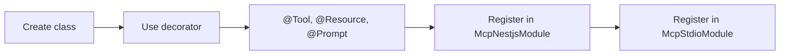

1. Create the class in `src/mcp/feature/tools/`, `resources/` or `prompts/`
2. Use `@Tool`, `@Resource`, `@ResourceTemplate` or `@Prompt` from `@rekog/mcp-nest`
3. Register in `McpNestjsModule` and `McpStdioModule` providers
